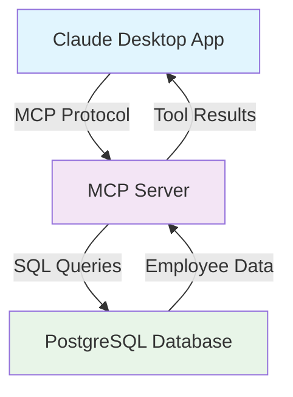
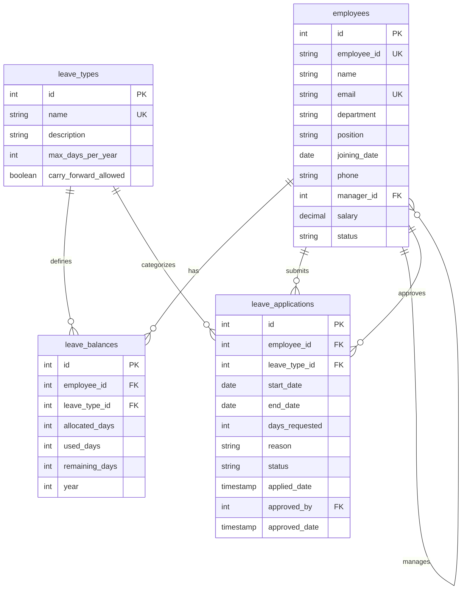

# Building a Model Context Protocol (MCP) Server for Employee Management

The Model Context Protocol (MCP) is revolutionizing how AI assistants interact with external systems and data sources. Instead of being limited to their training data, AI models can now access real-time information and perform actions through MCP servers. In this guide, we'll build a production-ready MCP server for employee management that integrates with PostgreSQL.

## What is MCP and Why Should You Care? 🤔

MCP is an open protocol that enables AI assistants like Claude to connect to external data sources and tools. Think of it as a bridge between AI and your applications - allowing the AI to read databases, call APIs, and perform complex operations on your behalf.

**Key Benefits:**
- **Real-time Data Access**: AI can query live databases instead of relying on static training data
- **Action Execution**: Perform operations like creating records, sending emails, or triggering workflows
- **Extensibility**: Add new capabilities to AI assistants without retraining models
- **Security**: Controlled access with proper authentication and validation

## What We'll Build 🏗️

Our employee management MCP server will provide these powerful tools:

1. **get_employee_info** - Retrieve detailed employee information
2. **get_employee_leaves** - Check leave balances and allocations
3. **get_employee_leave_applications** - View leave application history
4. **apply_employee_leave** - Submit leave requests with validation
5. **get_all_employees** - Admin function to list all employees



## Prerequisites 📋

Before we start, make sure you have:
- **Node.js** (v18 or higher)
- **PostgreSQL** (v12 or higher) or Docker
- **Claude Desktop** app installed
- Basic knowledge of TypeScript and SQL

## Step 1: Setting Up the Project 🚀

Create the MCP server using the official TypeScript template:

```bash
npx @modelcontextprotocol/create-server employee-server
cd employee-server
npm install pg @types/pg dotenv
```

This creates a well-structured project with all the necessary MCP server boilerplate and PostgreSQL dependencies.

## Step 2: Database Setup with Docker 🐳

If you have Docker, start a PostgreSQL container:

```bash
docker run --name postgres -e POSTGRES_PASSWORD=postgres -p 5432:5432 -d postgres
```

Create the database and tables:

```bash
docker exec -it postgres psql -U postgres -c "CREATE DATABASE employee_management;"
docker exec -i postgres psql -U postgres -d employee_management < database/setup.sql
```

The setup script creates 4 tables (employees, leave_types, leave_balances, leave_applications) and inserts sample data including 8 employees across different departments.



## Step 3: Environment Configuration ⚙️

Create a `.env` file with your database credentials:

```bash
cp .env.example .env
```

Update the `.env` file with your database connection details:

```
DB_HOST=localhost
DB_PORT=5432
DB_NAME=employee_management
DB_USER=postgres
DB_PASSWORD=postgres
```

## Step 4: Building the Server 🔨

The project structure includes:
- **Database layer**: Connection pooling and query utilities
- **Service layer**: Business logic for employee operations
- **MCP tools**: Tool definitions and request handlers
- **Type definitions**: TypeScript interfaces for type safety

Build the TypeScript project:

```bash
npm run build
```

Test the server connection:

```bash
node build/index.js
```

You should see: "Database connection successful" and "Employee Management MCP server running on stdio"


## Step 5: Claude Desktop Integration 🤖

Configure Claude Desktop to use your MCP server. Edit the configuration file:

**macOS:**
```bash
code ~/Library/Application\ Support/Claude/claude_desktop_config.json
```

**Windows:**
```bash
code %AppData%\Claude\claude_desktop_config.json
```

Add your server configuration:

```json
{
  "mcpServers": {
    "employee-server": {
      "command": "node",
      "args": ["/absolute/path/to/employee-server/build/index.js"],
      "env": {
        "DB_HOST": "localhost",
        "DB_PORT": "5432",
        "DB_NAME": "employee_management",
        "DB_USER": "postgres",
        "DB_PASSWORD": "postgres"
      }
    }
  }
}
```

**Important:** Use the absolute path to your project directory.

## Step 6: Testing the Integration 🧪

Restart Claude Desktop completely. You should now see the MCP tools available in the interface.

Test with these commands:
- "Get information for employee frank.miller@company.com"


- "What are the leave balances for alice.johnson@company.com?"


- "Show me all employees"


- "Apply for annual leave for alice.johnson@company.com from 2024-09-01 to 2024-09-05"

## Advanced Features Implemented 🚀

Our MCP server includes several production-ready features:

**Business Logic Validation:**
- Leave balance checking before approval
- Overlap detection for conflicting leave dates
- Manager hierarchy validation
- Date range validation

**Error Handling:**
- Database connection retry logic
- Comprehensive input validation
- User-friendly error messages
- Transaction rollback on failures

**Security Features:**
- SQL injection protection through parameterized queries
- Environment variable configuration
- Input sanitization and validation

## Troubleshooting Common Issues 🔧

**Server not appearing in Claude Desktop:**
```bash
# Check Claude Desktop logs
tail -f ~/Library/Logs/Claude/mcp*.log
```

**Database connection issues:**
```bash
# Test PostgreSQL connection
psql -h localhost -p 5432 -U postgres -d employee_management -c "SELECT COUNT(*) FROM employees;"
```

**Build errors:**
```bash
# Clean and rebuild
rm -rf build/
npm run build
```

## Sample Data Available 📊

The setup includes 8 sample employees:
- alice.johnson@company.com (Engineering)
- bob.smith@company.com (HR)
- carol.lee@company.com (Finance)
- david.wilson@company.com (Engineering)
- emma.davis@company.com (Marketing)
- frank.miller@company.com (Engineering Manager)
- grace.chen@company.com (Design)
- henry.taylor@company.com (Sales)

Each employee has pre-configured leave balances and some have existing leave applications for testing.

## Next Steps and Extensions 🎯

Now that you have a working MCP server, consider these enhancements:

**Additional Tools:**
- Employee onboarding workflows
- Performance review management
- Payroll integration
- Reporting and analytics

**Infrastructure Improvements:**
- Docker containerization
- CI/CD pipeline setup
- Monitoring and logging
- Database migrations

**Security Enhancements:**
- Role-based access control
- API rate limiting
- Audit logging
- Data encryption

## Conclusion ✅

Building an MCP server opens up powerful possibilities for AI-driven automation. Our employee management server demonstrates how to:
- Integrate AI with existing databases
- Implement complex business logic
- Provide secure, validated operations
- Create production-ready tools

The combination of MCP's flexibility with PostgreSQL's robustness creates a foundation for sophisticated AI-powered applications. Whether you're automating HR processes, managing customer data, or building custom workflows, MCP servers provide the bridge between AI capabilities and your business systems.

## Resources 📚

- [MCP Official Documentation](https://modelcontextprotocol.io/)
- [Claude Desktop Download](https://claude.ai/download)
- [PostgreSQL Documentation](https://www.postgresql.org/docs/)
- [TypeScript Handbook](https://www.typescriptlang.org/docs/)

---

*Have you built your own MCP server? Share your experience and use cases in the comments below!*
